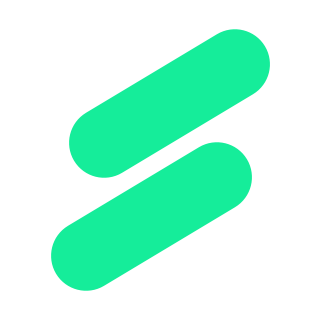

# 🚀 snklp.ai – AI-Powered Career Acceleration Platform

  
  
  ### **Smarter Preparation. Faster Success.**
  
  **Your AI-powered platform for interview mastery, coding excellence, resume optimization, and career growth.**
  
  
  
  
  

---

## 🎯 The Problem We Solve

### 😰 Struggling to get interview calls?
### 😓 Nervous during interviews?
### 📄 Unsure if your resume is strong enough?

snklp.ai helps you prepare smarter using AI-driven tools designed to improve your confidence, clarity, and technical strength — all in one platform.

> 🎯 With snklp.ai, you don’t just prepare. You perform.

---

## ✨ Core Features

### 🎤 AI Mock Interviews
Practice realistic AI-driven interviews with voice and video simulation.

### 🧠 Smart Question Generator
Get role-specific Technical, HR, and Behavioral questions tailored to your domain.

### 📊 Instant Feedback System
Receive structured feedback on:
- Communication
- Confidence
- Technical depth
- Clarity
- Professional presence

### 📹 Face & Posture Guidance
Improve your body language and on-camera presence with AI insights.

### 📄 Resume Optimizer
Enhance your resume using job-description aligned AI suggestions.

### 💻 AI Coding Practice
Solve real-world coding challenges with instant evaluation and analysis.

### ✍️ Cover Letter Generator
Create professional, personalized cover letters in seconds.

### 🧭 Career Navigator
Discover relevant job opportunities through AI-powered job matching.

### 👥 AI Group Discussion Simulator
Practice collaborative discussions with intelligent AI participants.

### 🎨 Portfolio Booster
Improve your GitHub and LinkedIn profiles with actionable AI recommendations.

---

## 🌟 Additional Capabilities

- 💬 Community Discussions
- 🤖 24/7 AI Career Assistant
- 🧪 Adaptive Skill-Based Quizzes
- 📈 Performance Tracking Dashboard

---

## 👥 Built For

| 🎓 Freshers | 🔄 Job Switchers | 💼 Internship Seekers |
|------------|----------------|----------------------|
| Starting your journey | Preparing for growth | Looking for real experience |

snklp.ai is built for anyone serious about accelerating their career.

---

## 🚀 Get Started

### Ready to level up your preparation?

**🔗 https://snklp.ai/**

---

## 🏷️ Tags

#snklpai #CareerAcceleration #AIForCareers #InterviewPrep #CodingPractice #ResumeBuilder #JobReady

---

## 💡 Why Choose snklp.ai?

| Feature | Benefit |
|----------|----------|
| AI-Driven Personalization | Tailored preparation based on your goals |
| Real-Time Feedback | Improve instantly with actionable insights |
| Comprehensive Tools | Resume + Interview + Coding + Career Guidance |
| 24/7 Availability | Practice anytime, anywhere |
| Industry-Aligned Content | Designed for modern hiring standards |

---

## 📞 Connect With Us

Have questions or want to collaborate?

- 🌐 Website: https://snklp.ai/
- 💻 GitHub: https://github.com/snklp-ai
- 📧 Email: support@snklp.ai

---

### 🎯 Prepare Smarter. Perform Better. Get Hired Faster.

